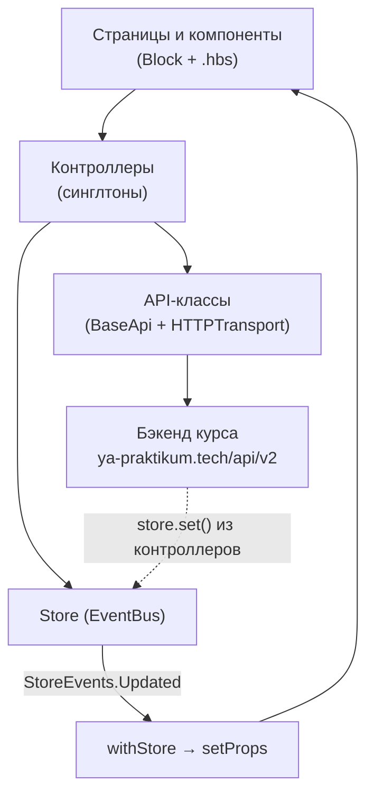

# Архитектура Chatty

Документы в этой папке описывают архитектуру учебного мессенджера **Chatty** (проект курса middle.messenger Яндекс Практикума): SPA на чистом TypeScript без фреймворков, с собственным компонентным слоем на Handlebars-шаблонах.

## Разделы

| Документ | О чём |
|---|---|
| [component-system.md](component-system.md) | Компонентный слой: `Block`, `EventBus`, `registerComponent`, `.hbs`-шаблоны, жизненный цикл |
| [routing-and-state.md](routing-and-state.md) | Роутинг (`Router`) и глобальное состояние (`Store`, `withStore`) |
| [data-layer.md](data-layer.md) | Контроллеры, API-слой, `HTTPTransport` (XHR), `WSTransport` (WebSocket) |
| [build-and-infra.md](build-and-infra.md) | Сборка Vite + кастомный плагин, express-сервер, тесты, CI, Netlify |
| [known-issues.md](known-issues.md) | Известные особенности и техдолг — бэклог для исправления |

## Общая картина

Приложение разделено на четыре слоя. Зависимости направлены сверху вниз, состояние возвращается наверх через событийную шину Store:



Ключевые принципы:

- **Компоненты не ходят в сеть.** За данные отвечают контроллеры; компонент вызывает метод контроллера и перерисовывается сам, когда контроллер обновит Store.
- **Единый источник правды о состоянии** — `Store`; подписка через HOC `withStore(mapStateToProps)`.
- **Никакого виртуального DOM.** `Block.setProps()` через Proxy запускает перерисовку блока целиком (replaceWith нового элемента).
- **Шаблоны — Handlebars**, компилируются в JS-модули на этапе сборки кастомным vite-плагином; вложенные компоненты вставляются в шаблон как Handlebars-хелперы.

## Раскладка по каталогам

```
src/
├── main.ts          # входная точка: регистрация компонентов, маршруты, bootstrap
├── core/            # компонентный фундамент: Block, EventBus, registerComponent
├── pages/           # страницы (роут-таргеты): login, register, chat, profile, 404, 500
├── components/      # переиспользуемые компоненты (.ts + .hbs рядом)
├── controllers/     # бизнес-логика: Auth, User, Chats, Messages (экспорт — синглтоны)
├── api/             # REST-клиенты над BaseApi/HTTPTransport
├── utils/           # Router, Store, HTTPTransport, WSTransport, validators, constants
├── helpers/         # isEqual, set/merge, fetchWithRetry (не используется)
└── scss/            # стили: components/, utils/ (миксины, переменные), libs/ (normalize)
```

## Известные особенности

Известные шероховатости и кандидаты на исправление собраны в отдельный бэклог: **[known-issues.md](known-issues.md)**.
