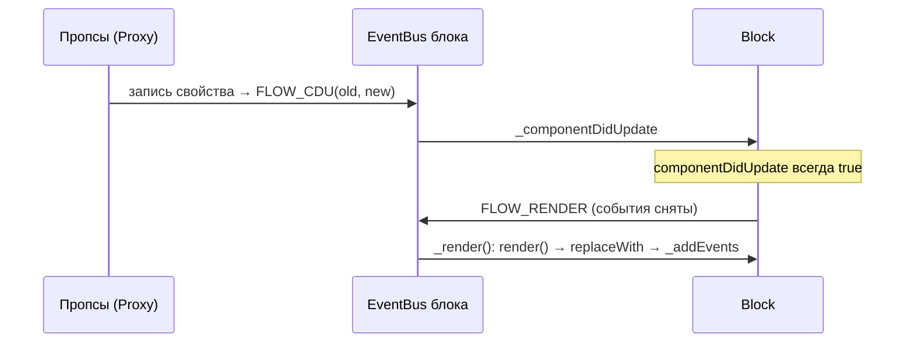

# Компонентный слой

Основа UI — собственный класс `Block` (`src/core/Block.ts`), вдохновлённый React-подобным жизненным циклом, но без виртуального DOM и реconciliation: изменение пропсов перерисовывает блок целиком.

## Участники

### `Block` — `src/core/Block.ts`

Базовый класс всех компонентов и страниц. Обязательный контракт наследника — переопределить `render()`:

```ts
export class Button extends Block {
    constructor(props: ButtonProps) {
        super({ ...props, events: { click: props.onClick } })
    }

    render() {
        return this.compile(template, this.props) // template — импорт из .hbs
    }
}
```

Ключевые механики:

- **Разделение props/children.** В конструкторе значения-инстансы `Block` из переданного объекта выносятся в `this.children`, остальное — в `this.props`. Дети передаются в шаблон как обычные пропсы.
- **Proxy над пропсами.** `this.props` обёрнут в Proxy: любая запись эмитит событие `FLOW_CDU` со старой и новой версией. `setProps(nextProps)` — просто `Object.assign` в этот Proxy. Удаление свойств запрещено (бросает ошибку).
- **Жизненный цикл на EventBus.** Каждый блок владеет собственным `EventBus`; события (`Block.EVENTS`): `init → flow:render → flow:component-did-mount` / `flow:component-did-update`. Хуки для наследников: `init()`, `componentDidMount()`, `componentDidUpdate(old, new)`.
- **Перерисовка.** `_render()` берёт `DocumentFragment` из `render()`, заменяет первый элемент фрагмента на место старого (`replaceWith`) и перевешивает DOM-события. События задаются пропсом `events: { click: fn, ... }` и вешаются на корневой элемент блока.
- **`compile(template, context)`** — рендер Handlebars-шаблона: прогоняет шаблон с контекстом, затем исполняет `embed`-функции детей (см. ниже) и возвращает `DocumentFragment`. В контекст подмешиваются `__refs` — карта ссылок на дочерние блоки.

### `EventBus` — `src/core/EventBus.ts`

Типизированный pub/sub (`on` / `off` / `emit`). Используется в трёх ролях: шина жизненного цикла блока, основа `Store` и основа `WSTransport`.

### `registerComponent` — `src/core/registerComponent.ts`

Регистрирует класс компонента как **Handlebars-хелпер**, что позволяет вкладывать компоненты друг в друга прямо в шаблоне:

```hbs
{{#Input ref="login" name="login" label="Login" /}}
```

Механика:

1. Хелпер создаёт инстанс `new Component(hash)` (hash = атрибуты шаблона = пропсы).
2. Возвращает заглушку `<div data-id="<nanoid>">…children…</div>`.
3. Инстанс и `embed`-функция кладутся в `root.__children`; если в атрибутах был `ref` — блок сохраняется в `root.__refs[ref]` (доступ из TS-кода через `this.refs.login`).
4. Когда родительский блок вызывает `compile()`, заглушки заменяются на реальные DOM-узлы детей (`stub.replaceWith(component.getContent())`), содержимое заглушки переносится внутрь ребёнка.

Двойная регистрация имени бросает ошибку.

### `.hbs`-шаблоны

Лежат рядом с компонентом (`button.ts` + `button.hbs`). На этапе сборки vite-плагин `vite-plugin-handelbars-precompile.ts` превращает `.hbs`-файл в ES-модуль с предкомпилированным шаблоном (`Handlebars.precompile`), поэтому в рантайме компиляции шаблонов нет. Подробнее — в [build-and-infra.md](build-and-infra.md).

## Жизненный цикл блока



Монтирование: `dispatchComponentDidMount()` (вызывается вручную/роутером) эмитит `FLOW_CDM` и рекурсивно то же для всех детей.

## Страницы и композиция

Страницы (`src/pages/*`) — те же `Block`, только крупнее: собирают композицию компонентов из пропсов-массивов и описывают обработчики. Например, `LoginPage` (`src/pages/login/login.ts`) передаёт в шаблон массивы `inputs` (с валидаторами) и `buttons` (с колбэками); клики уходят в `AuthController`/`Router`.

Реестр для регистрации хелперов — бочки `src/components/components.ts` и `src/pages/pages.ts`; их перебирает `src/main.ts` при старте.

## Ограничения и соглашения

- `componentDidUpdate` в базе всегда возвращает `true` — оптимизации «не перерисовывать при равных пропсах» нет (см. `isEqual` в [README.md](README.md#известные-особенности)).
- События навешиваются только на корневой элемент блока; для вложенных элементов используйте отдельные компоненты.
- Доступ к DOM ребёнка из родителя — через `ref` в шаблоне и `this.refs.<name>`, а не `querySelector`.
- Тесты компонентов кладутся рядом (`button.test.ts`) и в eslint не проверяются.
