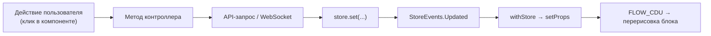

# Роутинг и состояние

## Router — `src/utils/Router.ts`

Singleton на History API (не hash-роутинг). Инстанс создаётся при импорте модуля и монтирует страницы в `#app` (см. `index.html`):

```ts
export default new Router('#app')
```

Устройство:

- **`Route`** — связка «путь → класс страницы → селектор корня». Хранит созданный инстанс блока; `leave()` обнуляет его (при возврате на маршрут страница создаётся заново).
- **`Router.use(pathname, BlockClass)`** — регистрация маршрута, возвращ `this` (чейнинг). Маршруты объявлены в `src/main.ts` (`Routes`), пути — константы в `src/utils/constants.ts`: `/`, `/sign-up`, `/settings`, `/messenger`, `/404`, `/500`.
- **`start()`** — вешает `window.onpopstate` и рендерит текущий путь.
- **`go(path)`** — `history.pushState` + немедленный рендер; **`back()` / `forward()`** — обёртки над history.

Особенности:

- Неизвестный путь: `getRoute` не находит маршрут, `_onRoute` тихо выходит — экран остаётся прежним. Автоперехода на `/404` нет.
- Защита маршрутов — не в роутере: `src/main.ts` на старте вызывает `AuthController.fetchUser()`; при ошибке не-публичные страницы редиректят на логин.

## Store — `src/utils/Store.ts`

Глобальное состояние приложения, расширяет `EventBus`. Один инстанс на модуль (`export default store`).

- **Форма состояния** — интерфейс `AppState`: `user`, `chats`, `selectedChat`, `chatUsers`, `messages`.
- **`set(keypath, data)`** — записывает по пути (`'messages.123'`, глубокий `set` из `src/helpers/helpers.ts`) и эмитит `StoreEvents.Updated` всем подписчикам.
- **`getState()`** — снимок состояния.

Пишут в Store только контроллеры (`store.set('chats', …)`); компоненты состояние не меняют.

## `withStore(mapStateToProps)` — HOC

Подписка компонента на состояние в декларативном стиле:

```ts
export class Messenger extends withStore(state => ({
    chats: state.chats,
    selectedChat: state.selectedChat,
}))(Block) { … }
```

Механика (`src/utils/Store.ts`):

1. В конструкторе обёртки `mapStateToProps` прогоняется над текущим состоянием, результат мержится в пропсы.
2. Подписка на `StoreEvents.Updated`: при каждом обновлении Store `mapStateToProps` вычисляется заново и результат уходит в `setProps` → блок перерисовывается (см. [component-system.md](component-system.md)).
3. Селектор может резать состояние — компонент перерисовывается при любом Updated, а не только «своих» данных (селективности нет).

Используется в `src/pages/profile/profile.ts`, `src/pages/chat/chat.ts`, `src/components/messenger/messenger.ts`.

## Полный цикл обновления


